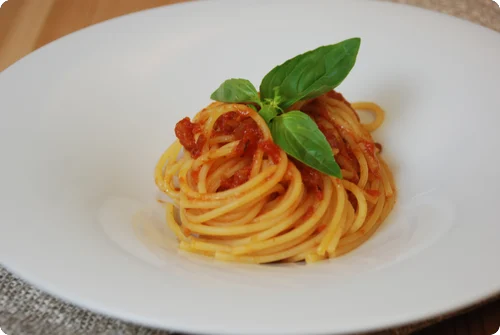
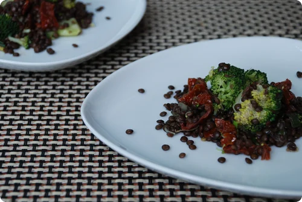
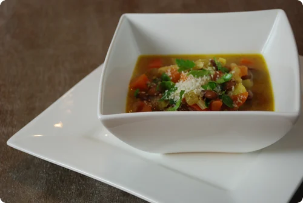

# RESERVE: drei Alltagsrezepte mit Originalfoto

Quellensammlung zur aktivierten Qualitätscharge `data/quality-batch-chuchitisch-v1.json`. Stand: 10.10.2026.

Die Rezeptseiten nennen Hannes und Martina als Rezeptautoren. Die strukturierten Quelldaten verlinken CC BY-SA 3.0. Die Website erklärt diese Lizenz auch für ihre Bilder. Die Lizenzseite verlangt eigene Fotos. Die Bildangabe wird dem veröffentlichten Autorenkonto Hannes und Martina / Chuchitisch zugeschrieben; eine separate Fotografenbestätigung liegt nicht vor.

Die übernommenen Rezepttexte und Fotos dieser Sammlung stehen unter [CC BY-SA 3.0](https://creativecommons.org/licenses/by-sa/3.0/). Fotos nur als WebP komprimiert; Zutaten und Originalportionen beibehalten. Die eingebundene Salatsauce wurde beim Linsensalat aus der sichtbaren Rezeptseite ergänzt. Nährwerte für die App-Adaption wurden aus USDA SR Legacy und Herstellerangaben berechnet; [Datenbasis und Annahmen](nutrition-basis.json).

## Spaghetti mit Tomatensauce

[Originalrezept](http://chuchitisch.ch/recipes/50) · Rezept: Hannes und Martina · 6 Personen · [Quelldaten](50.json)

### Zutaten

- Olivenöl
- 1   Zwiebel
- 1   Knoblauchzehe
- 400  g geschälte Tomaten
- 700  g passierte Tomaten
- 2  EL Tomatenpüree
- 1  EL Italienische Kräuter
- 1½  TL Gemüsebouillon
- 1  TL Zucker
- Salz
- Pfeffer
- 1  dl Weisswein
- 1  Zweig Basilikum
- 1  kg Spaghetti
- ---
- Reibkäse

### Zubereitung

Die Zwiebel hacken und in reichlich Olivenöl andünsten. Mit Weisswein ablöschen und diesen etwas einkochen lassen, dass die Zwiebeln gerade noch bedeckt sind.

Geschälte Tomaten würfeln und zusammen mit der Passata beigeben. Den Knoblauch dazupressen und die italienischen Kräuter (getrocknete Mischung oder frisch gehackten Rosmarin, Thymian und Basilikum) dazumischen. Mit Bouillonpaste würzen. Aufkochen und bei reduzierter Hitze 15 min köcheln lassen. Mit Salz, Pfeffer und etwas Zucker abschmecken.

Spaghetti in Salzwasser al dente kochen (gemäss Angaben auf der Packung). Die Spaghetti in die heisse Tomatensauce geben, etwas Olivenöl und je nach Geschmack Reibkäse dazugeben und gut mischen. Ist die Sauce zu fest, mit etwas Spaghettikochwasser verdünnen. Mit frischem Basilikum und Reibkäse servieren.

## Broccoli-Linsen-Salat

[Originalrezept](http://chuchitisch.ch/recipes/362) · Rezept: Hannes und Martina · 2 Personen · [Quelldaten](362.json)

### Zutaten

- 150  g Beluga-Linsen
- 1   Broccoli
- 10   Dörrtomaten
- 1   Frühlingszwiebel
- Salatsauce: 7½ cl Zitronensaft
- Salatsauce: 5 cl Rapsöl
- Salatsauce: 2½ cl Cenovis
- Salatsauce: ⅘ TL Senf
- Salatsauce: Salz

### Zubereitung

Linsen gemäss Packungsangaben 20-30 Minuten in ungesalzenem Wasser gar kochen.

Broccoli in Röschen schneiden und die Röschen z.B. im Dampfkörbchen bissfest garen, dann mit kaltem Wasser abschrecken.

Dörrtomaten in Stücke schneiden, Frühlingszwiebeln ebenfalls klein schneiden. Zusammen mit den Broccoliröschen zu den gekochten Linsen geben.

Salatsauce dazu geben, alles gut mischen und lauwarm oder kalt servieren.

Salatsauce: Alle Zutaten gut mischen.

## Minestrone

[Originalrezept](http://chuchitisch.ch/recipes/402) · Rezept: Hannes und Martina · 6 Personen · [Quelldaten](402.json)

### Zutaten

- 200  g getrocknete Borlottibohnen
- 200  g Stangensellerie
- 300  g Karotten
- 300  g festkochende Kartoffeln
- 300  g Lauch
- 2   Zwiebeln
- 1   Knoblauchzehe
- 5  EL Olivenöl
- 2  l Gemüsebouillon
- 2  dl Weisswein
- 4   Tomaten
- 200  g Pennette
- 3  EL Reibkäse

### Zubereitung

Die Bohnen über Nacht in kaltem Wasser einweichen (in einer genügend grossen Schüssel, da sich die Bohnen im Volumen verdoppeln).
In frischem Wasser ohne Salz 50 Minuten gar kochen.

Die grünen Blättchen vom Stangensellerie abzupfen (die können am Ende gehackt über die Suppe gestreut werden) und die Stangen in 0.5-1 cm grosse Stücke schneiden. Das Grün vom Lauch wegschneiden und den Rest wie den Sellerie in Stücke schneiden.
Kartoffeln und Karotten schälen und in gleich grosse, 1 cm grosse Würfelchen schneiden. Zwiebeln und Knoblauch hacken.

Alles Gemüse mischen und in einem grossen Topf im Olivenöl andünsten. Bouillon, Weisswein und die abgegossenen, gekochten Bohnen dazu geben. 30 Minuten zugedeckt bei kleiner Hitze köcheln lassen.

Die Tomaten entkernen und in Würfelchen schneiden. Zusammen mit den Teigwaren zur Suppe geben und 10 Minuten fertig kochen.

Die Suppe servieren und mit Reibkäse und gehackten Sellerieblättchen bestreuen.

## Umsetzung in RESERVE

- Bildnachweis mit Autorenkonto, Quelle, Lizenz und dokumentierter Zuschreibungsbasis.
- Zutaten pro Person in g/ml strukturiert; ergänzte Mengen und Stückgewichte im Rezeptnachweis dokumentiert.
- Nährwerte nachvollziehbar berechnet und in der Kochansicht als Schätzung gekennzeichnet.
- Quelle und Rezeptlizenz über „Quelle & Lizenz“ in der Kochansicht; Fotos zusätzlich im Bildnachweis.
- Minestrone: Einweichzeit separat anzeigen; mit trockenen Bohnen kein schnelles Feierabendgericht.
## Maroni-Linsen-Suppe

Freigegeben am 10.10.2026. [Originalrezept](http://chuchitisch.ch/recipes/277), Hannes und Martina, Text und Originalfoto CC BY-SA 3.0. [Originaldaten](277.json) · [Originalfoto als WebP](277.webp). Original: 2 Personen, 60 Minuten. Mengenannahmen und Umrechnung sind im Rezeptnachweis dokumentiert; Nährwertannahmen im nutritionEstimate-Block und nutrition-basis.json.
